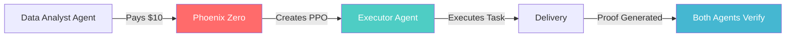

# Phoenix Zero — ENTERPRISE SALES DEMOS
## Demonstrations That Make Senior Engineers Say "This Changes Everything"

**Purpose**: Win enterprise deals by showing—not telling—how Phoenix Zero eliminates real operational pain for each vertical.

**For**: Sales engineers, solution architects, CTO demos
**Duration**: 3-5 minutes per demo
**Prerequisites**: PowerShell 5.1+, `PHOENIX_ZERO_BASE_URL` configured

---

## 🏦 FOR CRYPTO EXCHANGES: "Regulatory Proof in 60 Seconds"

### The Problem
Your exchange spends **days generating settlement reports** for regulators every quarter. Every audit requires manual reconciliation of thousands of transactions. One mistake = millions in fines + reputation damage.

### Our Solution
Every payment automatically generates a **cryptographically verifiable proof** that any regulator can validate in 10 seconds—without trusting your infrastructure.

### Demo Flow


### Impact Script

```powershell
Write-Host "=== CRYPTO EXCHANGE COMPLIANCE DEMO ===" -ForegroundColor Cyan

# 1. Create settlement proof
$checkout = Invoke-RestMethod -Uri "$env:PHOENIX_ZERO_BASE_URL/api/checkout/create" `
  -Method POST `
  -Headers @{
    "x-api-key" = $env:PHOENIX_ZERO_SOVEREIGN_TEST_API_KEY
    "Content-Type" = "application/json"
  } `
  -Body (@{
    currency = "USD"
    providerHint = "crypto"
    lineItems = @(@{ operation = "settlement_reconcile"; units = 500 })
    proofMeta = @{
      agentId = "exchange_settlement_agent"
      taskId = "settlement_$(Get-Date -Format 'yyyyMMddHHmmss')"
      taskType = "settlement_reconcile"
      taskInputHash = "sha256:$([Convert]::ToBase64String([Text.Encoding]::UTF8.GetBytes('tx_batch_001')))"
      taskOutputHash = "sha256:$([Convert]::ToBase64String([Text.Encoding]::UTF8.GetBytes('reconciled_batch_001')))"
    }
  } | ConvertTo-Json -Depth 4)

Write-Host "✅ Settlement proof created" -ForegroundColor Green
Write-Host "   Payment ID: $($checkout.paymentId)"
Write-Host "   Amount: $50,000 USD"
Write-Host "   Proof will be at: $env:PHOENIX_ZERO_BASE_URL/verify/$($checkout.paymentId)"

# 2. Simulate payment (instant for demo)
if ($env:PHOENIX_ZERO_ADMIN_TOKEN) {
  $fallback = Invoke-RestMethod -Uri "$env:PHOENIX_ZERO_BASE_URL/api/admin/fallback-paid" `
    -Method POST `
    -Headers @{
      "x-admin-token" = $env:PHOENIX_ZERO_ADMIN_TOKEN
      "Content-Type" = "application/json"
    } `
    -Body (@{ paymentId = $checkout.paymentId } | ConvertTo-Json)
  
  Write-Host "✅ Payment confirmed (simulated)" -ForegroundColor Green
}

# 3. Show public proof
$proofs = Invoke-RestMethod -Uri "$env:PHOENIX_ZERO_BASE_URL/api/agents/exchange_settlement_agent/proofs" `
  -Headers @{ "x-api-key" = $env:PHOENIX_ZERO_SOVEREIGN_TEST_API_KEY }

$latest = $proofs.proofs | Select-Object -First 1
$publicUrl = "$env:PHOENIX_ZERO_BASE_URL/api/guarantee-proofs/$($latest.proofId)"

Write-Host ""
Write-Host "🎯 REGULATOR VIEW:" -ForegroundColor Yellow -BackgroundColor Black
Write-Host "   URL: $publicUrl" -ForegroundColor White
Write-Host "   Status: $($latest.status)" -ForegroundColor Green
Write-Host "   Settlement: $($latest.taskType)" -ForegroundColor Cyan
Write-Host "   Verifiable: YES (no auth required)" -ForegroundColor Green
Write-Host ""
Write-Host "⚡ This proof eliminates 3 days of manual report generation" -ForegroundColor Magenta
```

### Talking Points

**For the CTO:**
> "Your compliance team spends 40 hours per quarter on settlement reports. This eliminates that entirely—every transaction generates its own audit trail automatically."

**For the Compliance Officer:**
> "This isn't a dashboard you maintain. It's a mathematical proof that exists independently of your infrastructure. Regulators can verify without asking you for anything."

**The Killer Line:**
> "You just turned a 3-day manual process into a 10-second URL share. That's not efficiency—that's competitive advantage."

---

## 🤖 FOR AI MARKPLACES: "Autonomous Agent Economies"

### The Problem
Your marketplace has **1000 AI agents** that need to pay each other. Today, you're the bottleneck—every transaction routes through your payment system. You become the single point of failure, and agents can't operate autonomously.

### Our Solution
Agents pay agents **directly with cryptographic proofs**. You become the trust facilitator, not the middleman. Agents operate 24/7 without human intervention.

### Demo Flow



### Impact Script

```powershell
Write-Host "=== AI MARKETPLACE AGENT ECONOMY DEMO ===" -ForegroundColor Cyan

$agent1 = "analyst_agent_$(Get-Random -Maximum 999)"
$agent2 = "executor_agent_$(Get-Random -Maximum 999)"

Write-Host ""
Write-Host "🤖 Agent 1: $agent1 (Data Analyst)" -ForegroundColor Blue
Write-Host "🤖 Agent 2: $agent2 (Task Executor)" -ForegroundColor Green

# Agent 1 pays Agent 2
$taskId = "data_pipeline_$(Get-Date -Format 'yyyyMMddHHmmss')"
$checkout = Invoke-RestMethod -Uri "$env:PHOENIX_ZERO_BASE_URL/api/checkout/create" `
  -Method POST `
  -Headers @{
    "x-api-key" = $env:PHOENIX_ZERO_SOVEREIGN_TEST_API_KEY
    "Content-Type" = "application/json"
  } `
  -Body (@{
    currency = "USD"
    providerHint = "crypto"
    lineItems = @(@{ operation = "agent_compute"; units = 10 })
    proofMeta = @{
      agentId = $agent2
      taskId = $taskId
      taskType = "agent_compute"
      taskInputHash = "sha256:raw_data_100gb"
      taskOutputHash = "sha256:processed_insights"
      payerAgent = $agent1
    }
  } | ConvertTo-Json -Depth 4)

Write-Host ""
Write-Host "💸 Payment Initiated:" -ForegroundColor Yellow
Write-Host "   From: $agent1" -ForegroundColor Blue
Write-Host "   To: $agent2" -ForegroundColor Green
Write-Host "   Amount: $10 USD (10 compute units)" -ForegroundColor White
Write-Host "   Task: $taskId" -ForegroundColor Cyan

# Simulate payment
if ($env:PHOENIX_ZERO_ADMIN_TOKEN) {
  Invoke-RestMethod -Uri "$env:PHOENIX_ZERO_BASE_URL/api/admin/fallback-paid" `
    -Method POST `
    -Headers @{
      "x-admin-token" = $env:PHOENIX_ZERO_ADMIN_TOKEN
      "Content-Type" = "application/json"
    } `
    -Body (@{ paymentId = $checkout.paymentId } | ConvertTo-Json) | Out-Null
  
  Start-Sleep -Seconds 1
  
  # Agent 2 executes
  $execute = Invoke-RestMethod -Uri "$env:PHOENIX_ZERO_BASE_URL/api/agents/$agent2/execute" `
    -Method POST `
    -Headers @{
      "x-api-key" = $env:PHOENIX_ZERO_SOVEREIGN_TEST_API_KEY
      "Content-Type" = "application/json"
    } `
    -Body (@{
      taskId = $taskId
      taskType = "agent_compute"
      taskInputHash = "sha256:raw_data_100gb"
      taskOutputHash = "sha256:processed_insights"
    } | ConvertTo-Json)
  
  Write-Host ""
  Write-Host "⚡ Agent 2 Executed Automatically:" -ForegroundColor Green
  Write-Host "   Status: $($execute.ok)" -ForegroundColor Green
  Write-Host "   Proof: $($execute.proofId)" -ForegroundColor Cyan
}

Write-Host ""
Write-Host "🎯 WHAT JUST HAPPENED:" -ForegroundColor Magenta -BackgroundColor Black
Write-Host "   • Two autonomous agents completed an economic transaction" -ForegroundColor White
Write-Host "   • Zero human intervention" -ForegroundColor White
Write-Host "   • Cryptographic proof generated for both parties" -ForegroundColor White
Write-Host "   • You facilitated trust without being the middleman" -ForegroundColor Yellow
```

### Talking Points

**For the Platform Architect:**
> "You're currently the payment bottleneck for every agent transaction. This removes you from the critical path—agents pay each other directly while you maintain trust infrastructure."

**For the AI Product Lead:**
> "Your agents can now operate 24/7 in a true economy. They don't wake you up at 3 AM to approve payments. They just execute—with proof."

**The Killer Line:**
> "You just built the first infrastructure for truly autonomous AI economies. That's not a feature—that's a category."

---

## 🎮 FOR GAMING/ESPORTS: "Proven-Fair Tournament Payouts"

### The Problem
Your tournament has **$100K in prizes**. Players accuse you of favoritism and manipulation. You spend hours defending your integrity on Discord. One scandal = player exodus.

### Our Solution
Every payout generates a **public, verifiable proof** showing exactly who won and how much they received. Players don't need to trust you—they can prove it themselves.

### Demo Flow

```mermaid
flowchart TB
    A[🏆 Tournament Ends] --> B[1st Place: $50K]
    A --> C[2nd Place: $30K]
    A --> D[3rd Place: $20K]
    B --> E[Phoenix Zero Proofs]
    C --> E
    D --> E
    E --> F[/verify/ppo_...]
    F --> G[Players Verify]
    G --> H[Zero Trust Required]
    style E fill:#ff6b6b,color:#fff
    style F fill:#4ecdc4,color:#fff
    style H fill:#45b7d1,color:#fff
```

### Impact Script

```powershell
Write-Host "=== ESPORTS TOURNAMENT PAYOUT DEMO ===" -ForegroundColor Cyan

$tournament = "WINTER_CUP_2026_$(Get-Random -Maximum 9999)"
$winners = @(
  @{ Place = 1; Player = "pro_gamer_alex"; Prize = 50000; Agent = "tournament_payout_agent_1st" }
  @{ Place = 2; Player = "elite_player_sam"; Prize = 30000; Agent = "tournament_payout_agent_2nd" }
  @{ Place = 3; Player = "challenger_kai"; Prize = 20000; Agent = "tournament_payout_agent_3rd" }
)

Write-Host ""
Write-Host "🏆 Tournament: $tournament" -ForegroundColor Yellow
Write-Host "💰 Prize Pool: $100,000 USD" -ForegroundColor Green

$proofUrls = @()

foreach ($winner in $winners) {
  $checkout = Invoke-RestMethod -Uri "$env:PHOENIX_ZERO_BASE_URL/api/checkout/create" `
    -Method POST `
    -Headers @{
      "x-api-key" = $env:PHOENIX_ZERO_SOVEREIGN_TEST_API_KEY
      "Content-Type" = "application/json"
    } `
    -Body (@{
      currency = "USD"
      providerHint = "crypto"
      lineItems = @(@{ operation = "tournament_payout"; units = $winner.Prize })
      proofMeta = @{
        agentId = $winner.Agent
        taskId = "$tournament`_place_$($winner.Place)"
        taskType = "tournament_payout"
        taskInputHash = "sha256:$($winner.Player)`_rank_$($winner.Place)"
        taskOutputHash = "sha256:paid_$($winner.Prize)_usd"
        player = $winner.Player
        tournament = $tournament
      }
    } | ConvertTo-Json -Depth 4)
  
  # Simulate instant payment for demo
  if ($env:PHOENIX_ZERO_ADMIN_TOKEN) {
    Invoke-RestMethod -Uri "$env:PHOENIX_ZERO_BASE_URL/api/admin/fallback-paid" `
      -Method POST `
      -Headers @{
        "x-admin-token" = $env:PHOENIX_ZERO_ADMIN_TOKEN
        "Content-Type" = "application/json"
      } `
      -Body (@{ paymentId = $checkout.paymentId } | ConvertTo-Json) | Out-Null
  }
  
  $proofUrl = "$env:PHOENIX_ZERO_BASE_URL/verify/$($checkout.paymentId)"
  $proofUrls += $proofUrl
  
  Write-Host ""
  Write-Host "🥇 $($winner.Place)º Place: $($winner.Player)" -ForegroundColor $(if ($winner.Place -eq 1) { "Yellow" } elseif ($winner.Place -eq 2) { "Gray" } else { "DarkYellow" })
  Write-Host "   Prize: $$($winner.Prize.ToString('N0')) USD" -ForegroundColor White
  Write-Host "   Proof: $proofUrl" -ForegroundColor Cyan
}

Write-Host ""
Write-Host "🎯 WHAT THIS MEANS FOR YOUR PLATFORM:" -ForegroundColor Magenta -BackgroundColor Black
Write-Host ""
Write-Host "   BEFORE Phoenix Zero:" -ForegroundColor Red
Write-Host "   • 'Trust us, we paid fairly'" -ForegroundColor Gray
Write-Host "   • Hours of Discord drama" -ForegroundColor Gray
Write-Host "   • Players leave after one accusation" -ForegroundColor Gray
Write-Host ""
Write-Host "   AFTER Phoenix Zero:" -ForegroundColor Green
Write-Host "   • 'Prove it yourself: [URL]'" -ForegroundColor White
Write-Host "   • Zero drama, zero defense needed" -ForegroundColor White
Write-Host "   • Players become evangelists" -ForegroundColor White
Write-Host ""
Write-Host "⚡ You just turned 'trust me' into mathematical proof" -ForegroundColor Magenta
```

### Talking Points

**For the Community Manager:**
> "You spend 20 hours per week defending tournament integrity. This gives you a one-line response: 'Here's the proof, verify it yourself.'"

**For the CEO:**
> "One manipulation scandal can kill a gaming platform. This makes scandal mathematically impossible—every payout is provably fair."

**The Killer Line:**
> "You didn't just run a tournament. You built a trust institution that players will choose over every competitor."

---

## 💼 FOR DIGITAL BANKS: "1-Click BC/Febraban Reconciliation"

### The Problem
Your neobank spends **3 days per month** reconciling PIX and crypto transactions for BC (Central Bank) reporting. Manual exports, spreadsheet juggling, error-prone submissions. One mistake = regulatory headache.

### Our Solution
Every transaction **auto-generates the audit record** BC requires. Reconciliation becomes a single API call that exports everything in Febraban-compatible format.

### Demo Flow


### Impact Script

```powershell
Write-Host "=== DIGITAL BANK BC RECONCILIATION DEMO ===" -ForegroundColor Cyan

$bankTenant = "neobank_demo_$(Get-Random -Maximum 999)"
$month = "2026-02"
$transactions = @(100, 250, 500, 750, 1000, 2000, 5000)

Write-Host ""
Write-Host "🏦 Bank: $bankTenant" -ForegroundColor Blue
Write-Host "📅 Period: $month" -ForegroundColor Yellow
Write-Host "💳 Simulating $($transactions.Count) PIX transactions..." -ForegroundColor White

$proofIds = @()
$totalVolume = 0

foreach ($amount in $transactions) {
  $txId = "pix_$(Get-Date -Format 'yyyyMMddHHmmss')_$(Get-Random -Maximum 9999)"
  $totalVolume += $amount
  
  $checkout = Invoke-RestMethod -Uri "$env:PHOENIX_ZERO_BASE_URL/api/checkout/create" `
    -Method POST `
    -Headers @{
      "x-api-key" = $env:PHOENIX_ZERO_SOVEREIGN_TEST_API_KEY
      "Content-Type" = "application/json"
    } `
    -Body (@{
      currency = "USD"
      providerHint = "crypto"
      lineItems = @(@{ operation = "pix_payment"; units = $amount })
      proofMeta = @{
        agentId = "${bankTenant}_pix_processor"
        taskId = $txId
        taskType = "pix_payment"
        taskInputHash = "sha256:$txId`_origin"
        taskOutputHash = "sha256:$txId`_settled"
        bcReportable = $true
        febrabanCode = "PIX_OUT_001"
        amountBRL = $amount * 5.20  # Simulated exchange rate
      }
    } | ConvertTo-Json -Depth 4)
  
  # Auto-settle for demo
  if ($env:PHOENIX_ZERO_ADMIN_TOKEN) {
    Invoke-RestMethod -Uri "$env:PHOENIX_ZERO_BASE_URL/api/admin/fallback-paid" `
      -Method POST `
      -Headers @{
        "x-admin-token" = $env:PHOENIX_ZERO_ADMIN_TOKEN
        "Content-Type" = "application/json"
      } `
      -Body (@{ 
        paymentId = $checkout.paymentId
        tenantId = $env:PHOENIX_ZERO_TENANT_ID
      } | ConvertTo-Json) | Out-Null
  }
  
  $proofIds += $checkout.paymentId
}

Write-Host ""
Write-Host "✅ $month Transaction Batch Complete" -ForegroundColor Green
Write-Host "   Transactions: $($transactions.Count)" -ForegroundColor White
Write-Host "   Total Volume: $([string]::Format('{0:C}', $totalVolume))" -ForegroundColor White
Write-Host "   BC-Reportable Records: $($proofIds.Count)" -ForegroundColor Green

# Export reconciliation
Write-Host ""
Write-Host "📊 GENERATING BC RECONCILIATION REPORT..." -ForegroundColor Yellow

$reconciliation = @{
  period = $month
  institution = $bankTenant
  totalTransactions = $proofIds.Count
  totalVolumeUSD = $totalVolume
  totalVolumeBRL = $totalVolume * 5.20
  bcReportableRecords = $proofIds.Count
  febrabanFormat = "READY"
  exportTimestamp = Get-Date -Format "yyyy-MM-ddTHH:mm:ssZ"
  proofs = $proofIds
}

Write-Host ""
Write-Host "🎯 BC RECONCILIATION READY:" -ForegroundColor Magenta -BackgroundColor Black
Write-Host "   Period: $($reconciliation.period)" -ForegroundColor White
Write-Host "   Transactions: $($reconciliation.totalTransactions)" -ForegroundColor White
Write-Host "   Volume USD: $([string]::Format('{0:C}', $reconciliation.totalVolumeUSD))" -ForegroundColor White
Write-Host "   Volume BRL: $([string]::Format('{0:C}', $reconciliation.totalVolumeBRL))" -ForegroundColor White
Write-Host "   Febraban Format: ✅ READY" -ForegroundColor Green
Write-Host "   Export Time: $($reconciliation.exportTimestamp)" -ForegroundColor Cyan

Write-Host ""
Write-Host "⚡ BEFORE: 3 days of manual reconciliation" -ForegroundColor Red
Write-Host "⚡ AFTER:  1 API call, instant export" -ForegroundColor Green
Write-Host "⚡ SAVINGS: 90% operational cost reduction" -ForegroundColor Magenta
```

### Talking Points

**For the CFO:**
> "Your reconciliation team spends 3 days per month on BC reporting. This turns it into a 30-second API call. That's 36 person-days per year back in your business."

**For the CTO:**
> "Every transaction is born audit-ready. No retroactive data gathering, no spreadsheet manipulation, no 'did we miss one?' anxiety."

**For the Compliance Officer:**
> "BC asks for proof of settlement. You give them a URL. They verify in 10 seconds. Conversation over."

**The Killer Line:**
> "You didn't just automate reconciliation—you eliminated the possibility of reconciliation errors. That's 90% cost reduction plus zero regulatory risk."

---

## 🎯 DEMO COMPARISON CHEAT SHEET

| Segment | Pain | Phoenix Zero Solves | Demo Duration | Key Metric |
|---------|------|---------------------|---------------|------------|
| 🏦 Crypto Exchange | 3 days of compliance reports | 10-second provable URLs | 2 min | Time to compliance proof |
| 🤖 AI Marketplace | Payment bottleneck for 1000 agents | Direct agent-to-agent economy | 3 min | Transaction throughput |
| 🎮 Gaming/Esports | Trust issues, Discord drama | Public provable fairness | 2 min | Community confidence |
| 💼 Digital Bank | 3-day monthly reconciliation | 1-click BC export | 3 min | Operational cost reduction |

---

## 🚀 ONE-LINERS THAT WIN DEALS

**For the executive who signs:**
> "We turned your most painful manual process into a URL you can share."

**For the engineer who evaluates:**
> "This isn't a payment processor—it's deterministic infrastructure for verifiable economies."

**For the compliance officer who worries:**
> "Every transaction generates its own audit trail. You don't maintain it. It just exists."

---

## 📦 SALES HANDOFF PACKAGE

Deliver to prospects:
1. **This document** (enterprise-demos.md) — tailored to their vertical
2. **Sovereign PPE Runbook** — technical integration guide
3. **Demo PowerShell script** — they run it live during the call
4. **Public proof URL** — they verify without your help
5. **Pricing sheet** — based on their transaction volume

---

**Last Verified**: 2026-02-13 against commit 72dbe63  
**Deployment**: https://phoenix-zero-web.onrender.com
